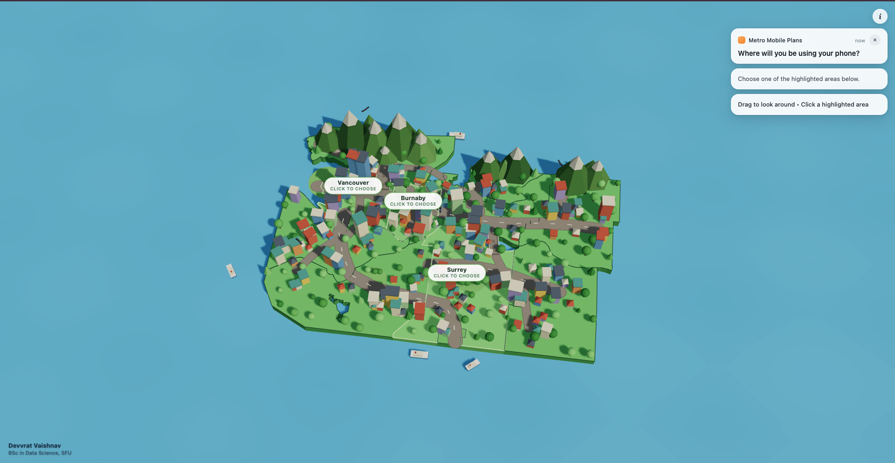
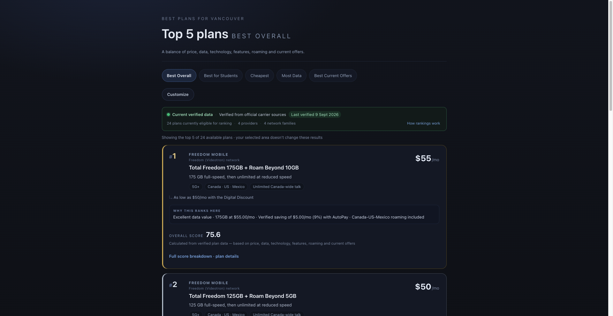
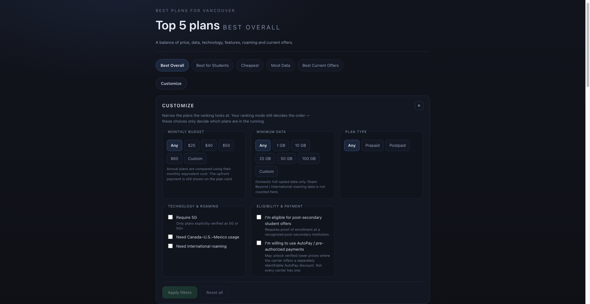
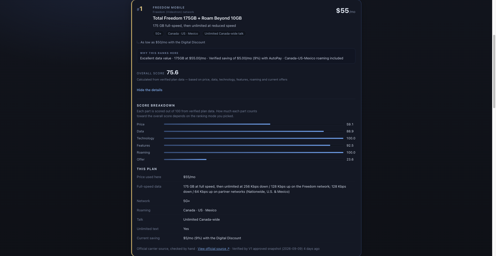

# Metro Mobile Plans

Metro Mobile Plans is an interactive mobile-plan comparison platform for Metro
Vancouver. It combines a 3D location-selection experience with a deterministic
ranking engine built on current verified carrier data.

**Live Website:** https://metromobileplans.vercel.app/


*Interactive Metro Vancouver map*

## Overview

Mobile phone plans are difficult to compare directly: price, data allowances,
network technology, promotions, roaming, and eligibility conditions (student
offers, AutoPay discounts, bundles) all vary between carriers and are rarely
presented on the same terms.

Metro Mobile Plans gives users a single interface to choose a supported
municipality, compare current verified plans across carriers, switch between
ranking presets built for different priorities, and apply their own filters —
without any of the scoring logic running in the browser.


*Top 5 ranked plans*

## Key Features

- Interactive 3D miniature Metro Vancouver map
- Vancouver, Burnaby, and Surrey selection
- Animated character with pathfinding and a cinematic camera transition into
  the results view
- Top-5 mobile-plan rankings
- Five ranking modes: Best Overall, Best for Students, Cheapest, Most Data,
  Best Current Offers
- Custom filters for budget, minimum data, plan type, 5G, roaming, student
  eligibility, and AutoPay willingness
- Per-plan component score breakdowns
- "Why this ranks here" explanations for every ranked plan
- Official-source links and verification/freshness information on every plan
- Backend warm-up and result prefetching for faster perceived load times


*Custom ranking filters*

## How the Ranking Works

Rankings are produced by a **deterministic, rule-based scoring engine** — not
by AI or machine learning. The same input data always produces the same
ranking and the same explanation text.

Each plan is scored on six components:

- Price
- Data
- Technology
- Features
- Roaming
- Offer value (current savings)

Each ranking preset applies a different fixed weighting to those six
components — for example, "Cheapest" weights price only, while "Best Overall"
balances all six.

Annual plans are converted to a monthly-equivalent price for fair comparison,
while the actual upfront payment and billing term are still shown in full.

A broadly-available AutoPay / Digital Discount price — one a carrier itemizes
as its own advertised price, open to any customer who enrolls — is used by
default, with the regular price shown as secondary information; users can opt
out to rank on regular prices only. Restricted or targeted conditional pricing
— such as student pricing, Bell bundle pricing, or other partner/employer
eligibility — is only applied once the user explicitly confirms they meet that
condition. Otherwise, the plan's regular, unconditional price is used.

The selected municipality currently provides context only and does not change
the ranking. The project does not fabricate municipality-specific network
quality scores without trustworthy, area-level performance data to support
them.


*Deterministic score breakdown*

## Data & Verification

The V1 dataset draws on official carrier sources for four providers:

- Chatr
- Bell
- Koodo
- Freedom Mobile

Chatr is retrieved through an automated official-source adapter. Bell, Koodo,
and Freedom Mobile currently use manually verified official-source captures —
an operator records the official plan page and transcribes the plan data from
it.

For every plan, the backend stores the raw source evidence, the official
source URL, and a history of verification events, so pricing and plan details
can be traced back to where they came from. Unknown or unpublished information
is left blank rather than guessed.

Data is periodically re-verified rather than fetched live on every request,
and the product deliberately avoids describing it as real-time.

## Technology Stack

### Frontend
- React 19
- TypeScript
- Vite
- Three.js
- React Three Fiber
- Drei
- CSS
- Vitest

### Backend
- Python
- FastAPI
- Uvicorn
- Pydantic
- SQLAlchemy
- Alembic
- httpx
- BeautifulSoup
- pytest

### Database
- PostgreSQL (Neon, in production)
- SQLite (local development)

### Deployment
- Vercel — frontend
- Render — FastAPI backend
- Neon — PostgreSQL database

## Architecture

```
User
  ↓
React / Three.js Frontend (Vercel)
  ↓
FastAPI REST API (Render)
  ↓
Ranking + Pricing + Verification Logic
  ↓
PostgreSQL (Neon)
```

## Testing

- Backend: a pytest suite of 197 passing tests, covering the ranking engine,
  pricing/offer resolution, data pipeline, and API, according to the current
  repository audit.
- Frontend: Vitest coverage for the supported-municipality logic used by the
  map.

This is targeted test coverage of the core logic, not a full end-to-end test
suite.

## Supported Coverage

**Municipalities**
- Vancouver
- Burnaby
- Surrey

**Carriers**
- Chatr
- Bell
- Koodo
- Freedom Mobile

This reflects the current V1 scope. It is not complete Canadian carrier
coverage or complete Metro Vancouver municipality coverage.

## Local Development

### Frontend

```sh
npm install
npm run dev      # Vite dev server, expects the backend at http://localhost:8000
npm run build    # type-check + production build
npm run lint
npm test         # Vitest
```

### Backend

```sh
cd backend
python3 -m venv .venv
.venv/bin/pip install -e ".[dev]"
.venv/bin/alembic upgrade head      # creates a local SQLite database
.venv/bin/metromobile bootstrap     # loads the approved V1 dataset
.venv/bin/metromobile serve         # runs the API on :8000
.venv/bin/pytest
```

## Limitations

- V1 currently supports four carriers and three selectable municipalities.
- Data is periodically verified rather than fetched live for every request.
- Bell, Koodo, and Freedom Mobile currently require manual re-verification
  against their official pages.
- The Render free backend instance may cold-start after a period of
  inactivity, which can delay the first request.
- Municipality selection currently provides geographic context but does not
  alter network ranking.

## Geographic Data

Municipal boundaries come from the **Province of British Columbia**'s
authoritative GIS dataset *"Municipalities – Legally Defined Administrative
Areas of BC"* (BC Data Catalogue, Open Government Licence – British Columbia),
retrieved from the province's public WFS endpoint. Shapes are real legal
boundaries, not approximations. Full details and regeneration instructions:
[`src/data/README.md`](src/data/README.md).

## Author

**Devvrat Vaishnav**
BSc Data Science — Simon Fraser University

Live Website: https://metromobileplans.vercel.app/
